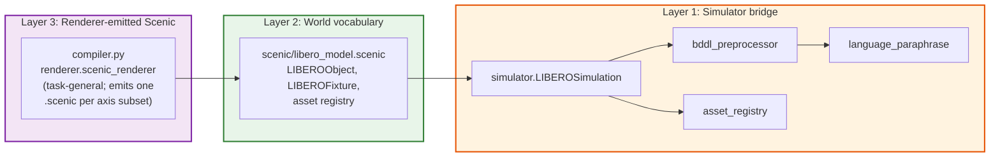
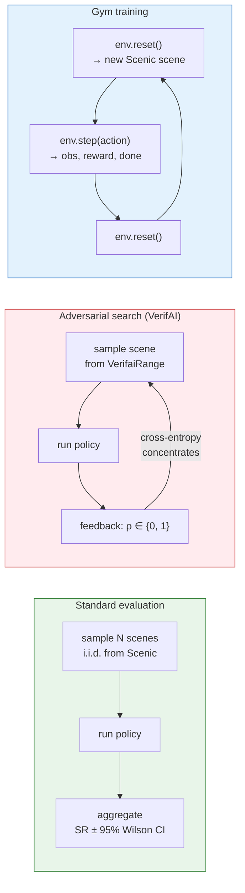
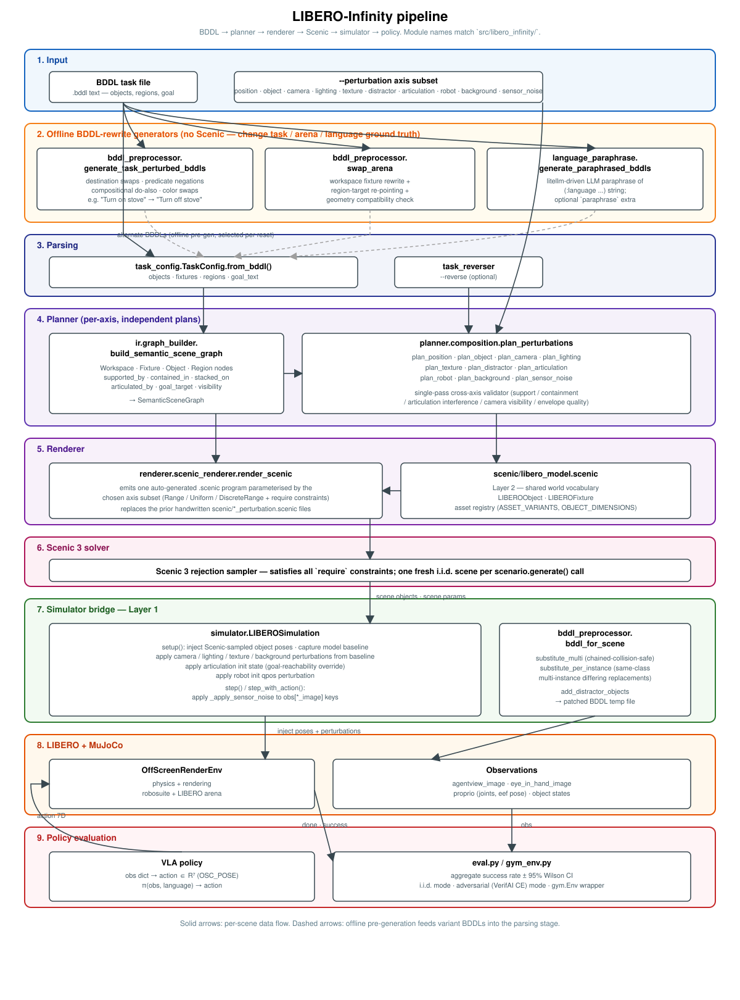

# LIBERO-Infinity Architecture Diagram

The pipeline below mirrors the actual code paths in `src/libero_infinity/`
as of the latest revision. All axis names and module labels match what
the source ships.

## System Pipeline

```mermaid
flowchart TD
    subgraph Input["Input"]
        BDDL["BDDL task file"]
        FLAG["--perturbation axes<br/>position, object, camera,<br/>lighting, texture, distractor,<br/>articulation, robot, background,<br/>sensor_noise"]
    end

    subgraph Offline["Offline BDDL-rewrite generators (no Scenic)"]
        TP["bddl_preprocessor.<br/>generate_task_perturbed_bddls<br/><br/>destination swaps,<br/>predicate negations,<br/>compositional do-also,<br/>visible-attribute swaps"]
        AS["bddl_preprocessor.<br/>swap_arena<br/><br/>workspace fixture rewrite<br/>+ region target re-pointing<br/>+ geometry compatibility check"]
        LP["language_paraphrase.<br/>generate_paraphrased_bddls<br/><br/>litellm-driven paraphrase<br/>of (:language ...) string"]
    end

    subgraph Parse["Parsing"]
        TC["task_config.<br/>TaskConfig.from_bddl()"]
        TR["task_reverser<br/>(--reverse)"]
    end

    subgraph Plan["Planner (per-axis)"]
        IR["ir.graph_builder.<br/>build_semantic_scene_graph<br/>→ SemanticSceneGraph"]
        AX["planner.composition.<br/>plan_perturbations<br/><br/>plan_position, plan_object,<br/>plan_camera, plan_lighting,<br/>plan_texture, plan_distractor,<br/>plan_articulation, plan_robot,<br/>plan_background, plan_sensor_noise"]
    end

    subgraph Render["Renderer"]
        REN["renderer.scenic_renderer.<br/>render_scenic<br/><br/>emits a single auto-generated<br/>.scenic program parameterised<br/>by the chosen axis subset"]
        LM["scenic/libero_model.scenic<br/><br/>shared world vocabulary<br/>LIBEROObject, LIBEROFixture,<br/>asset registry"]
    end

    subgraph ScenicSolver["Scenic 3"]
        CS["Scenic 3 rejection sampler<br/>satisfies all 'require' constraints<br/>per scenario.generate() call"]
    end

    subgraph Bridge["Simulator bridge"]
        SIM["simulator.LIBEROSimulation<br/><br/>setup(): inject scene poses,<br/>apply camera / lighting / texture /<br/>background perturbations from baseline<br/><br/>step(): apply sensor_noise<br/>transform to obs[*_image]"]
        BDDLP["bddl_preprocessor.<br/>bddl_for_scene<br/>(asset substitution +<br/>distractor injection)"]
    end

    subgraph Engine["LIBERO + MuJoCo"]
        ENV["OffScreenRenderEnv<br/>physics + rendering"]
        OBS["Observations<br/>agentview_image, eye_in_hand_image,<br/>proprio + object states"]
    end

    subgraph Policy["Policy evaluation"]
        VLA["VLA policy"]
        RES["eval.py / gym_env.py<br/>aggregate SR ± 95% Wilson CI<br/>per-scene breakdown"]
    end

    BDDL --> TP
    BDDL --> AS
    BDDL --> LP
    TP -. "alternate BDDLs<br/>selected per reset" .-> TC
    AS -. .-> TC
    LP -. .-> TC

    BDDL --> TC
    BDDL --> TR
    TC --> IR
    TR --> IR
    FLAG --> AX
    IR --> AX
    AX --> REN
    LM --> REN
    REN --> CS
    CS -->|"scene.objects<br/>scene.params"| SIM
    BDDLP --> SIM
    SIM --> ENV
    ENV --> OBS
    OBS --> VLA
    VLA -->|"action 7D"| ENV
    ENV --> RES

    style Input fill:#E3F2FD,stroke:#1565C0,stroke-width:2px
    style Offline fill:#FFF8E1,stroke:#F57F17,stroke-width:2px
    style Parse fill:#E8EAF6,stroke:#283593,stroke-width:2px
    style Plan fill:#EDE7F6,stroke:#5E35B1,stroke-width:2px
    style Render fill:#F3E5F5,stroke:#7B1FA2,stroke-width:2px
    style ScenicSolver fill:#FCE4EC,stroke:#AD1457,stroke-width:2px
    style Bridge fill:#E8F5E9,stroke:#2E7D32,stroke-width:2px
    style Engine fill:#FFF3E0,stroke:#E65100,stroke-width:2px
    style Policy fill:#FFEBEE,stroke:#C62828,stroke-width:2px
```

## Layered Scenic Design



## Evaluation modes



## Rendered diagram (SVG)


